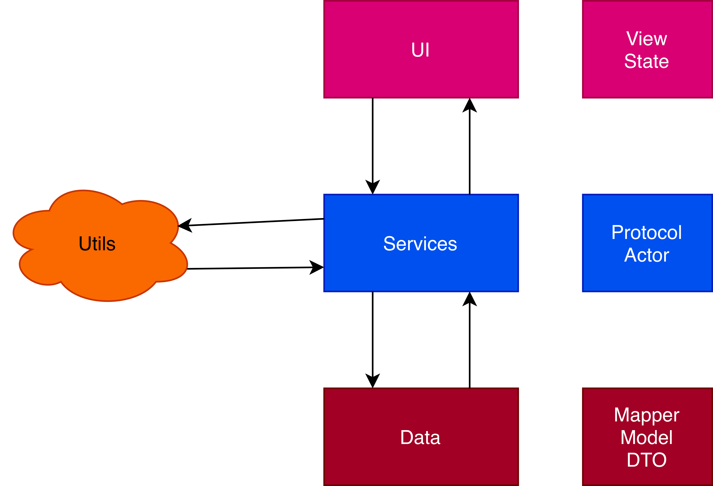
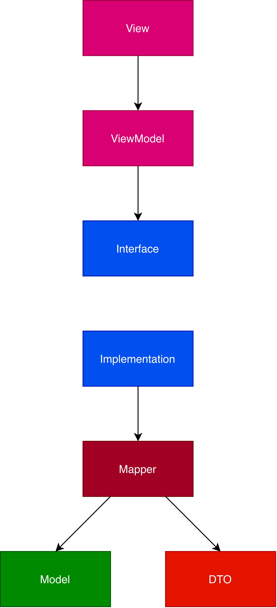
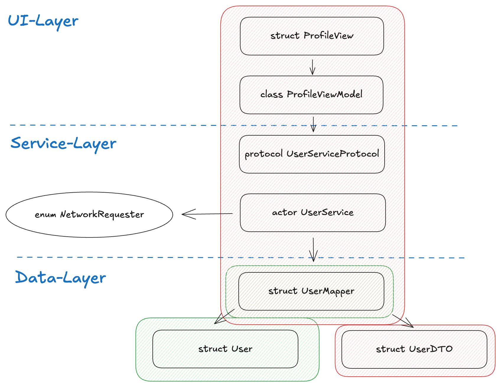

## Swift Architecture

### High level architecture

<div style="display: flex; justify-content: center">
    
</div>

### Dependency chart - Eiffel Tower model

<div style="display: flex; justify-content: center; width: 100%">
    
</div>


### Concrete naming example - Eiffel Tower model

<div style="display: flex; justify-content: center">
    
</div>


# 2. UI layer

### State

```swift
@Observable
class SomeState {
    var name: String = "John"
}

struct SomeView: View {
    @State private var someState = SomeState()

    var body: some View {
        //...
    }
}
```

#### Shared States (Environment)

```swift
@main
struct SomeApp: App {
    @State private var someState = SomeState()
    
    var body: some Scene {
        WindowGroup {
            ContentView()
                .environment(someState)
        }
    }
}

struct ContentView: View {
    var body: some View {
        SomeView()
    }
}

struct SomeView: View {
    @Environment(SomeState.self) var someState

    var body: some View {
        //...
    }
}
```

### View

```swift
struct SomeView: View {
    @State private var someState = SomeState()

    var body: some View {
        //...
    }
}

private extension SomeView {
    var calculatedField: Int { ... }

    func doSomething() { ... }
}
```

It is recommended to split the Views into reusable PartialViews as much as possible. This makes the UI layer more readable and also applies the clean code principles.

```swift
struct SomeListView: View {
    @State private var someState = SomeState()

    var body: some View {
        VStack {
            List(someState.words, id: \.self) { word in
                SomeListItemPartialView(word: word)
            }
        }
    }
}

struct SomeListItemPartialView: View {
    let word: String 

    var body: some View {
        Text(word)
    }
}
```

## Service layer

### Interface

```swift
protocol SomeServiceProtocol {
    func fetchSomething() async throws -> [String]?
}
```

### Implementation

```swift
actor SomeService: SomeServiceProtocol {
    func fetchSomething() async throws -> [String]? {
        //...
    }
}
```

### Provider

```swift
enum ServiceProvider {
    static func makeSomeService() -> SomeServiceProtocol {
        SomeService()
    }
}
```

## Data layer

### Model

```swift
struct User {
    let firstname: String
    let lastname: String
    var fullname: String { "\(firstname) \(lastname)" }
}
```

### DTO

```swift
struct UserDTO: Decodable {
    let firstname: String
    let lastname: String
}
```

### Mapper

```swift
struct UserMapper {
    func getUserFromJson(_ json: String) -> User? {
        do {
            let userDTO = try getUserDTOFromJson(json)
            
            return map(from: userDTO)
        }
        catch {
            print("Error parsing JSON: \(error)")
            return nil
        }
    }
    
    func getUsersFromJson(_ json: String) -> [User] {
        do {
            let userDTOs = try getUserDTOsFromJson(json)
            
            return userDTOs.map { userDTO in
                map(from: userDTO)
            }
        }
        catch {
            print("Error parsing JSON: \(error)")
            return []
        }
    }
}

extension UserMapper {
    private func map(from userDTO: UserDTO) -> User {
        return User(firstname: userDTO.firstname, lastname: userDTO.lastname)
    }
    
    private func getUserDTOFromJson(_ json: String) throws -> UserDTO {
        return try JSONDecoder().decode(UserDTO.self, from: Data(json.utf8))
    }
    
    private func getUserDTOsFromJson(_ json: String) throws -> [UserDTO] {
        return try JSONDecoder().decode([UserDTO].self, from: Data(json.utf8))
    }
}
```

## Utils

### Networkrequests in the util layer

```swift
enum HTTPMethod: String { case GET, POST, PUT, DELETE }

enum NetworkRequester {
    static func request<T: Decodable>(
        url: URL,
        method: HTTPMethod = .GET,
        headers: [String: String] = [:],
        body: Data? = nil,
        jwt: String? = nil
    ) async throws -> T {
        var request = URLRequest(url: url)
        request.httpMethod = method.rawValue
        if let body = body { request.httpBody = body }
        if let jwt = jwt {
            request.addValue("Bearer \(jwt)", forHTTPHeaderField: "Authorization")
        }
        headers.forEach { request.addValue($1, forHTTPHeaderField: $0) }
        
        let (data, _) = try await URLSession.shared.data(for: request)
        return try JSONDecoder().decode(T.self, from: data)
    }
}
```